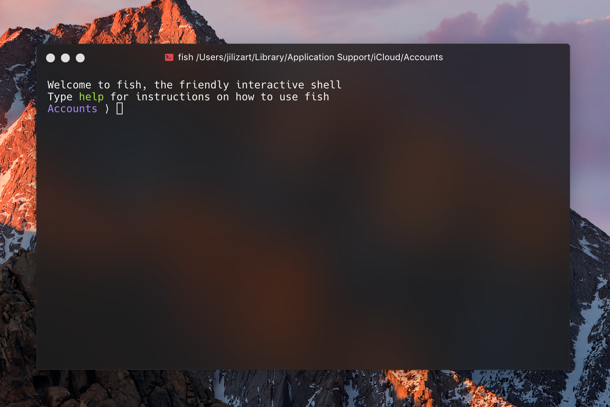

# hyper-monokai-vibrancy

> Monokai theme for [HyperTerm](https://hyperterm.org) with vibrancy support

## Install

Add `hyper-monokai-vibrancy` to the plugins list in your `~/.hyper.js` config file.

## License

MIT © [Badr Chaouai](http://arkhamdev.com)
